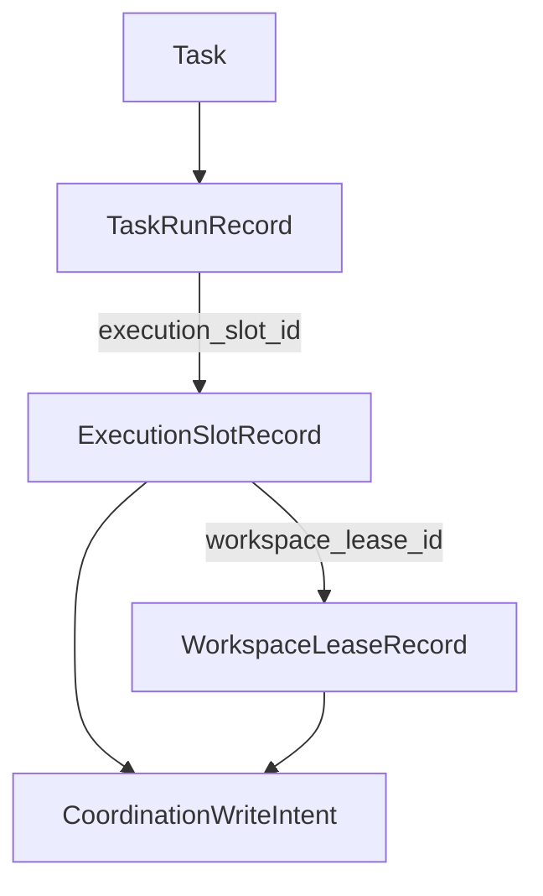

# Execution Slot 与 Coordination Model V1

## 1. 背景

这份文档记录 Spotlight 在吸收 ClawTeam 执行层能力和 Network-AI 协调治理能力时，第一阶段已经落地的最小模型。

当前参考来源：

- `docs/clawteam-reference-gap-analysis.md`
- `docs/network-ai-reference-gap-analysis.md`
- `docs/workspace-serialization-transition-2026-03-28.md`

这一阶段对应的重构边界 tag：

- `pre-execution-slot-coordination-model-20260329`

目标不是一次性做完完整蜂群执行内核，而是先把“执行边界”和“协调写入边界”从隐式状态，升级成可持久化、可归一化、可继续演进的数据模型。

## 2. 一阶段目标

- 让 `task-run` 不再只是把 `thread` 挂在 `task` 上，而是先挂到显式的 `execution slot`
- 让旧的 persisted state 在服务端启动时可以自动回填 `slot` / `lease`
- 让 `start / resume / completed / failed / interrupted` 这些 run 生命周期，能够驱动 `slot` 和 `lease` 同步变化
- 先为关键协调动作留下最小治理痕迹，避免后续再从零补审计锚点

## 3. 为什么暂时不把 `execution_slot_id` 直接加到 `Task`

本轮明确不把 `execution_slot_id` 直接挂到 `Task`，原因有三点：

- `Task` 的显式构造点很多，直接加字段会把这次最小模型切入变成大面积初始化改造
- `Task` 是产品级工作项，不是纯运行态实体；未来一个 task 可能有多次 run，也可能对应多个历史 slot，直接挂在 `Task` 上容易把“当前态”和“历史态”混在一起
- 从 `TaskRunRecord.execution_slot_id` 切入，可以先把执行边界稳稳钉在运行链路上，后续如果需要再评估是否把“当前活动 slot”做成 task 级投影字段

当前结论是：

- `Task` 继续表达产品语义
- `TaskRunRecord` 表达一次运行实例
- `ExecutionSlotRecord` 表达一次被调度、可恢复、可治理的执行槽

## 4. 当前模型关系

当前一阶段字段关系如下：

- `TaskRunRecord.execution_slot_id`
  - 表达某次 run 当前绑定的 slot
- `ExecutionSlotRecord.task_id`
  - 表达 slot 属于哪个 task
- `ExecutionSlotRecord.task_run_id`
  - 表达 slot 当前服务的是哪个 run
- `ExecutionSlotRecord.workspace_lease_id`
  - 表达 slot 当前持有的工作区租约
- `WorkspaceLeaseRecord.slot_id`
  - 表达租约由哪个 slot 持有
- `CoordinationWriteIntent`
  - 记录 `slot.open / slot.backfill / lease.acquire / lease.backfill` 这些关键协调动作

## 5. 当前已落地行为

### 5.1 persisted state 归一化

`normalize_persisted_state` 现在除了做任务状态归一化，还会：

- 为已有运行痕迹但缺少 run history 的旧任务回填最小 `TaskRunRecord`
- 为最新 run 回填 `execution_slot_id`
- 为 slot 回填 `workspace lease`
- 为上述回填动作补最小 `CoordinationWriteIntent`

这意味着旧版本状态文件升级后，不会继续停留在“任务看起来暂停了，但系统并不知道它原来占用了什么执行边界”的半升级状态。

### 5.2 run 生命周期联动

当前已经接通：

- `record_task_run_start`
  - 启动或恢复 run 时创建或复用 slot
  - 同步创建或复用 lease
- `record_task_run_transition`
  - 在 `completed / failed / interrupted / aborted` 时同步刷新 slot 状态
  - 在 run 进入终态时释放 lease

### 5.3 最小回归保护

已经新增并跑通的回归测试：

- `normalize_persisted_state_backfills_execution_slot_and_workspace_lease_for_paused_task`
- `record_task_run_start_and_completion_manage_execution_slot_lifecycle`
- `automation_cycle_auto_start_records_run_history`
- `automation_cycle_auto_resume_records_run_history`
- `select_next_auto_resume_task_*`

## 6. 一阶段语义边界

这一轮只是最小模型，不等于完整实现。当前明确保留以下边界：

### 6.1 `WorkspaceLease` 还是“共享工作区上的租约影子模型”

当前的 `lease` 还不是独立 worktree，也不是独立 clone。

它现在表达的是：

- 某个 slot 正在占用哪条执行 lane
- 该占用是否还活跃
- 何时释放、为什么释放

它还没有表达：

- 真正的物理隔离工作区实例
- owner / sandbox / branch / snapshot 级别的完整执行现场

### 6.2 `CoordinationWriteIntent` 还不是完整黑板系统

当前 intent 只覆盖 slot / lease 生命周期锚点。

它还没有扩展到：

- artifact handoff
- dependency unlock
- decision commit
- budget reservation / settle
- capability grant / revoke

### 6.3 冲突策略当前只落了最小骨架

数据模型里已经有：

- `first-commit-wins`
- `priority-wins`
- `last-write-wins`

但一阶段真实使用的只有最小的 `first-commit-wins` 风格锚点记录，后续还要把校验、仲裁和并发回归补齐。

## 7. 相比原实现的能力增长

和原来的“task + runtime thread + 主工作区”相比，当前已经有了三点明确增长：

- 执行边界显式化
  - 现在 run 可以绑定到 `execution slot`，恢复和治理不再只能围着 task/thread 打补丁
- 工作区占用显式化
  - 现在至少能知道某个执行槽占用了哪条 lane，并在终态时释放
- 协调动作可追踪
  - slot / lease 的创建与回填已经有最小 intent 记录，后续扩到原子共享状态时不需要再回头补“第一颗审计钉子”

## 8. 下一阶段顺序

基于这一版模型，后续顺序固定为：

1. 补 `slot heartbeat / slot watchdog / slot-level recovery policy`
2. 把 `workspace lease` 从共享工作区影子模型升级到真正的隔离 worktree
3. 把 `CoordinationWriteIntent` 从 slot/lease 扩到 artifact、decision、budget、grant
4. 再推进 `scoped capability grant`、`federated budget`、`journey / compliance / quality gate`

结论很明确：

这一版不是终点，但它已经把 Spotlight 从“只有任务状态机”推进到了“有最小执行槽和最小协调状态”的阶段，后面继续吸收 ClawTeam 和 Network-AI 的关键能力，已经有了稳定落脚点。
