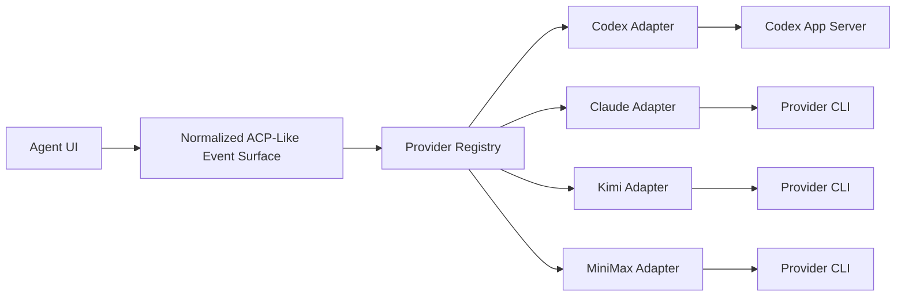

# Provider Abstraction

## 1. Goal

The product should not be permanently coupled to Codex CLI.

Codex CLI is the first provider, but the architecture should support additional local model CLIs such as:

- Claude
- Kimi
- MiniMax
- future internal or third-party CLIs

## 2. Design Rule

The UI should only know one interaction model:

- task-bound sessions
- streaming messages
- tool or command events
- file changes
- audit-worthy actions
- status transitions

Provider-specific details should live below that boundary.

## 3. Recommended Runtime Shape



For Codex specifically, the first implementation should use the native `codex app-server` runtime rather than forcing a generic ACP transport at the lowest layer.

The UI and platform still remain provider-neutral because the adapter emits normalized runtime events upward.

## 4. Provider Contract

Each provider adapter should implement a common trait or interface similar to:

```rust
trait AgentProvider {
    fn provider_id(&self) -> &'static str;
    fn start_session(&self, config: SessionConfig) -> Result<SessionHandle>;
    fn resume_session(&self, session: StoredSession) -> Result<SessionHandle>;
    fn send_input(&self, session_id: &str, input: ProviderInput) -> Result<()>;
    fn interrupt(&self, session_id: &str) -> Result<()>;
    fn capabilities(&self) -> ProviderCapabilities;
}
```

## 5. Capability Model

Different providers will not expose identical features.

Suggested capability flags:

- streaming text
- structured tool call events
- file write events
- command execution visibility
- session resume
- cancellation
- custom system prompt
- working directory control

UI behavior:

- render full functionality when capability exists
- degrade gracefully when capability is missing

## 6. ACP Compatibility Strategy

Preferred order:

1. use the richest native runtime protocol when it materially improves execution quality
2. normalize native runtime behavior into the Spotlight event surface
3. add ACP adapters for interoperability where appropriate
4. use text-only fallback mode only if necessary

Important constraint:

- if a future provider does not expose enough structure for tool calls, file actions, or command visibility, it cannot offer a full equivalent Agent UI experience

Codex-specific rule for the first real runtime:

- use `codex app-server` as the native provider runtime
- do not leak Codex-specific event names above the adapter boundary
- reserve standard ACP support for a future interoperability layer

## 7. Data Model Impact

Agent records should store provider metadata.

Minimum fields:

- `provider_type`
  - `codex`, `claude`, `kimi`, `minimax`, `custom`
- `provider_mode`
  - `native_acp`, `adapted`, `text_only`
- `provider_version`
- `capabilities`
  - json metadata

## 8. Audit Impact

Audit should remain provider-neutral.

Required principles:

- keep normalized event types stable
- store provider-specific raw payload as supplemental metadata
- preserve provider name and version for debugging

This makes dashboards and acceptance views consistent across providers.

## 9. Execution Policy Impact

Workspace, git tag, rollback, retry, and acceptance policy should not depend on provider type.

Those rules belong to the platform, not the model vendor.

## 10. MVP Recommendation

For the first release:

- implement the provider abstraction now
- ship only the Codex adapter
- let the Codex adapter talk to `codex app-server`
- keep the Agent UI provider-neutral
- validate future adapters against the same acceptance and audit contract

This gives you a clean path to add Claude, Kimi, or MiniMax later without redesigning the task model or UI.
