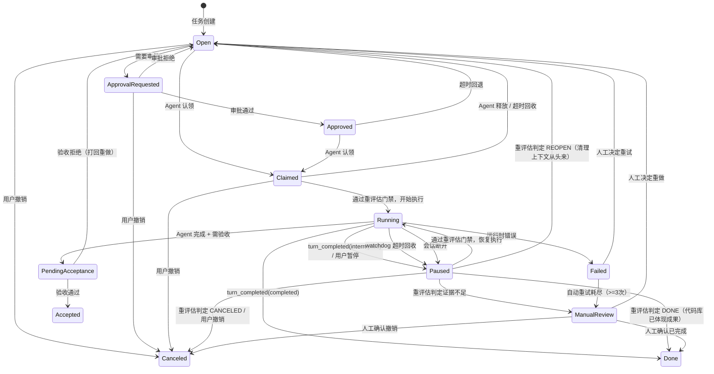
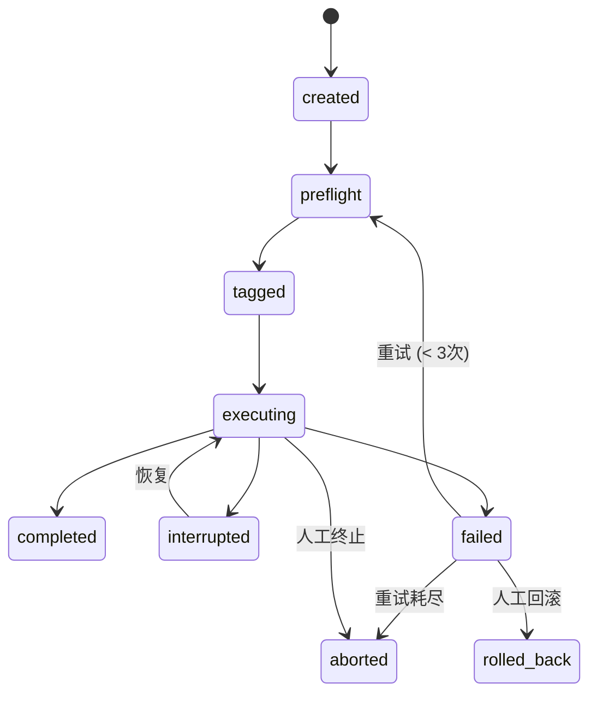

# 多 Agent 协作状态机

## 1. 设计前提

Spotlight 是分布式多 Agent 协作平台。一个任务可能被 Agent-A 执行一半后暂停，被 Agent-B 认领接手，而 Agent-C 可能已经通过另一个任务完成了相同工作。

因此状态机不只管"单任务流转"，还必须处理：

- **任务交接**：Agent 之间的持有权转移
- **重评估门禁**：进入工作态前必须检查代码库现状
- **并行冲突**：同一工作区同一时刻只允许一个任务处于执行态
- **恢复与放弃**：会话中断后的自动恢复或清理

## 2. 状态维度

系统有五个独立但关联的状态维度：

| 维度 | 管什么 | 示例 |
|------|--------|------|
| **任务状态** | 任务的生命周期 | Open → Running → Done |
| **任务运行状态** | 单次执行的内部阶段 | preflight → executing → completed |
| **会话状态** | Codex CLI 的连接生命周期 | connecting → active → disconnected |
| **审批状态** | 执行前的人工审批 | not_required / requested / approved |
| **验收状态** | 执行后的人工验收 | not_started / pending / accepted |

## 3. 任务状态机（核心）

### 3.1 状态定义

| 状态 | 含义 | 终结态？ | 可被认领？ |
|------|------|----------|-----------|
| `Open` | 待处理，等待认领 | 否 | 是 |
| `Claimed` | 已被某 Agent 认领，准备执行 | 否 | 否 |
| `ApprovalRequested` | 需要审批后才能执行 | 否 | 否 |
| `Approved` | 已通过审批，可以执行 | 否 | 是 |
| `Running` | 正在由 Agent 执行 | 否 | 否 |
| `Paused` | 执行中断，可恢复或重评估 | 否 | 否（需评估） |
| `PendingAcceptance` | Agent 已完成，等待人工验收 | 否 | 否 |
| `Accepted` | 已通过验收 | **是** | 否 |
| `Done` | 已完成（无需验收或已自动确认） | **是** | 否 |
| `Failed` | 执行失败 | **是** | 否 |
| `ManualReview` | 需要人工决策 | 否 | 否 |
| `Canceled` | 已撤销 | **是** | 否 |

### 3.2 状态转换图



### 3.3 终结态规则

以下状态是终结态，不再参与任何评估或认领：
- `Done`、`Accepted`、`Failed`、`Canceled`

任何 Agent 遇到终结态任务应直接跳过。

## 4. 重评估门禁（Reassess Gate）

### 4.1 为什么需要

在多 Agent 环境下，任务元数据可能滞后于代码库现实：

- Agent-A 做了任务 T1 一半，会话断开，T1 变成 Paused
- Agent-B 做了任务 T2，恰好覆盖了 T1 的全部工作，T2 变成 Done
- 此时 Agent-C 认领 T1 如果不检查代码库，就会重复劳动

### 4.2 触发条件

以下场景必须触发重评估门禁：

| 场景 | 说明 |
|------|------|
| Paused → Running | 恢复暂停的任务前 |
| Open（有进度痕迹）→ Claimed | 认领曾被执行过的任务前 |
| ManualReview → 任何状态 | 人工复核后做决定前 |
| auto-mode Agent 自动认领 | 自动认领循环中 |

以下场景**不需要**触发：

| 场景 | 说明 |
|------|------|
| Open（纯新任务）→ Claimed | 从未执行过，直接认领 |
| 终结态任务 | 已结束，跳过 |
| 被其他 Agent 持有中 | Claimed/Running 且有 claimed_by |

### 4.3 评估三步法

Agent 在重评估门禁中必须按顺序执行：

**第一步：检查代码库现状**
- `git log --oneline -20` 查看最近提交
- 检查任务描述中提到的文件/功能是否已存在
- 如果有测试要求，跑测试看是否通过
- 对照任务交付清单逐项核对

**第二步：对照同项目其他任务**
- 查看同项目已完成（Done/Accepted）的任务列表
- 检查是否有标题相近或工作范围重叠的已完成任务
- 如果有，判断重叠程度

**第三步：综合判断**

| 判定 | 条件 |
|------|------|
| `DONE` | 代码库已体现任务目标的全部成果（不管是谁完成的） |
| `PARTIAL_DONE` | 代码库已体现部分成果，剩余部分可拆新任务 |
| `CANCELED` | 任务目标已被取消、废弃或被更好的方案替代 |
| `RESTART` | 目标仍然有效，代码库尚未体现，有可恢复的 thread |
| `REOPEN` | 目标仍然有效，但运行上下文已丢失，需从头执行 |
| `MANUAL_REVIEW` | 证据矛盾或不足，需要人工决定 |

### 4.4 快速规则引擎（不依赖 Agent）

当 Agent 不可用时，系统用规则引擎做快速判断：

```
if 运行输出有完成证据       → DONE (0.9)
if 活动中有取消/不做信号     → CANCELED (0.8)
if 恢复循环 >= 3 次         → REOPEN (0.85)
if thread not found          → REOPEN (0.85)
if 有 thread 且状态 Paused   → RESTART (0.8)
if Paused 但无 thread        → REOPEN (0.7)
else                         → MANUAL_REVIEW (0.5)
```

### 4.5 API

```
POST /api/v1/tasks/{task_id}/reassess       — 单任务评估
POST /api/v1/projects/{project_id}/reassess  — 项目级批量评估
```

## 5. Agent 状态与持有权

### 5.1 Agent 状态

| 状态 | 含义 |
|------|------|
| 空闲 | 无持有任务，可认领新任务 |
| CLAIMED | 已认领任务，准备执行 |
| RUNNING | 正在执行任务 |

### 5.2 持有权规则

```
1. 一个 Agent 同时只能持有一个任务
2. 系统按工作区串行执行：同一工作区同时只允许一个任务处于 `Claimed` / `Running`
3. Agent 释放持有权的时机：
   - 任务进入终结态
   - 任务被暂停
   - watchdog 检测到超时
   - 会话断开
4. 持有权不跨重启保留：
   - 服务重启时所有 Claimed/Running 任务归一化为 Paused
   - 所有 Agent 的 current_task_id 清空
```

### 5.3 多 Agent 交接场景

```
时间线:
  t1: Agent-A 认领 Task-1, 开始执行
  t2: Agent-A 会话断开, Task-1 → Paused, Agent-A 释放持有
  t3: Agent-B 空闲, 发现 Task-1 可恢复
  t4: Agent-B 触发重评估门禁:
      - 检查代码库 → 发现 Task-1 的工作只完成一半
      - 对照其他任务 → 没有重叠的已完成任务
      - 判定: RESTART
  t5: Agent-B 恢复 Task-1, 从 Agent-A 断点继续
  t6: Agent-B 完成 Task-1 → Done
```

```
时间线（重叠工作场景）:
  t1: Agent-A 认领 Task-1 "实现登录功能", 执行一半后断开
  t2: Agent-B 认领 Task-2 "实现用户认证模块", 完成 → Done
      (Task-2 的工作覆盖了 Task-1 的范围)
  t3: Agent-C 空闲, 发现 Task-1 处于 Paused
  t4: Agent-C 触发重评估门禁:
      - 检查代码库 → 登录功能已存在且测试通过
      - 对照其他任务 → Task-2 已完成，标题和范围高度重叠
      - 判定: DONE（代码库已体现成果）
  t5: Task-1 标记为 Done, 无需再执行
```

## 6. 任务运行状态（Run State）

每个任务可以有多次运行，但同时只有一个活跃运行。

### 6.1 状态

| 状态 | 含义 |
|------|------|
| `created` | 运行记录已创建 |
| `preflight` | 预检（Git 分支准备等） |
| `tagged` | 已创建预执行快照 |
| `executing` | 正在执行 |
| `interrupted` | 被中断（可恢复） |
| `completed` | 执行完成 |
| `failed` | 执行失败 |
| `rolled_back` | 已回滚 |
| `aborted` | 已放弃 |

### 6.2 转换



### 6.3 不变量

- 运行必须记录重试次数
- 运行必须关联所有会话
- Git 快照必须在 executing 之前完成
- 回滚不擦除历史记录

## 7. 会话状态

会话是与 Codex CLI 的本地连接。

| 状态 | 含义 |
|------|------|
| `connecting` | 正在启动 CLI 进程 |
| `active` | 会话活跃，可收发消息 |
| `paused` | 会话暂停（turn interrupted） |
| `disconnected` | 连接断开（进程退出） |
| `resuming` | 正在恢复之前的 thread |
| `closed` | 正常关闭 |
| `errored` | 异常终止 |

**规则**：
- 一个运行可以有多个会话（断开重连）
- 同时只有一个活跃会话
- 断开的会话可以通过 thread_id 恢复
- 恢复的会话必须关联到同一个运行

## 8. 审批状态

| 状态 | 含义 |
|------|------|
| `not_required` | 不需要审批（默认） |
| `requested` | 已提交审批 |
| `approved` | 已批准 |
| `denied` | 已拒绝 |
| `expired` | 审批超时 |

## 9. 验收状态

| 状态 | 含义 |
|------|------|
| `not_started` | 未开始验收（默认） |
| `pending` | 等待验收 |
| `accepted` | 验收通过 |
| `rejected` | 验收拒绝（打回重做） |

## 10. 并行冲突处理

### 10.1 串行执行约束

当前实现不是“全局只能跑一个任务”，而是按工作区串行：同一物理工作区同一时刻只允许一个活跃任务处于 `Claimed` / `Running`。

不同工作区的任务可以并行推进。

如果多个项目指向同一个物理工作区，也仍然视为同一个串行 lane。

如果检测到同一工作区存在多个活跃任务：
1. 按优先级和最近活动时间选择一个保留
2. 其余任务回收到 Open，清空 claimed_by
3. 被回收任务记录 `task.parallel_requeued` 活动

### 10.2 watchdog 回收

后台每 5 秒检查一次：
- Running 任务超过 300 秒无日志输出 → Paused
- Running 任务缺少 active_turn_id → Paused
- Running 任务无对应会话 → Paused
- Claimed 任务超过 300 秒未启动 → Paused

并行回收只处理同一工作区内的冲突活跃任务，不会因为另一个工作区也有运行任务而误回收。

## 11. 状态归一化（服务重启时）

服务端重启时对所有任务做一次归一化：

| 检测条件 | 动作 |
|----------|------|
| Running/Claimed + 有进度痕迹 | → Paused（等待恢复） |
| 有完成证据但状态非 Done | → Done |
| Running 但无 active_turn_id | 清理 turn_id |
| Open 但有执行痕迹（非 reassessed） | → Paused |
| 无优先级 | 根据版本号推断优先级 |
| Agent 持有已终结任务 | 释放 Agent |
