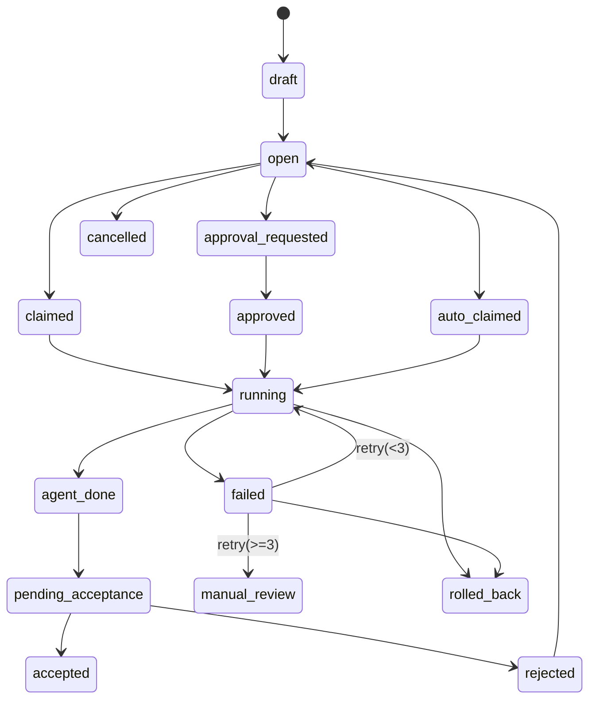
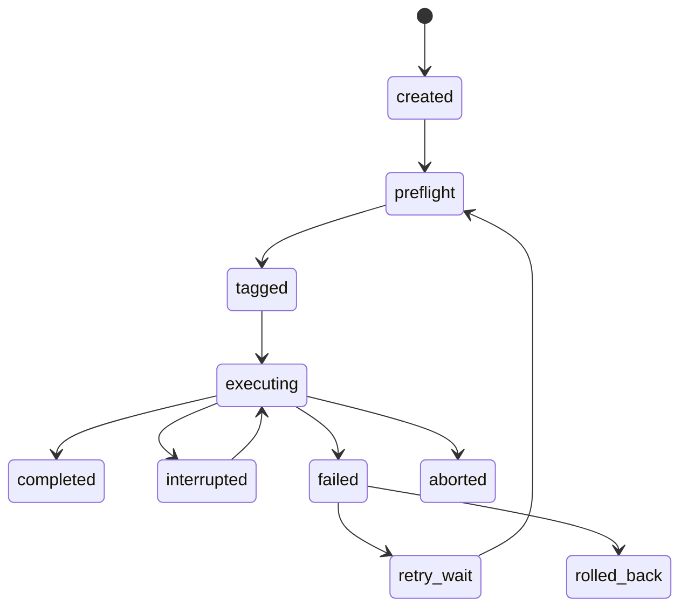

# State Machine

## 1. Overview

The system has four distinct but related state dimensions:

- task state
- task run state
- session state
- approval state
- acceptance state

Separating these avoids ambiguous UI and keeps audit trails accurate.

## 2. Task State

### 2.1 Canonical States

- `draft`
- `open`
- `claimed`
- `approval_requested`
- `approved`
- `auto_claimed`
- `running`
- `agent_done`
- `pending_acceptance`
- `accepted`
- `rejected`
- `failed`
- `manual_review`
- `rolled_back`
- `cancelled`

### 2.2 Transition Rules

### 2.3 Notes

- `claimed` is primarily for human-driven execution preparation.
- `auto_claimed` is used when an Agent in auto mode pulls a queued task.
- `approved` is an execution-ready state after approval.
- `agent_done` means the Agent run is complete, but human acceptance has not finished yet.
- `pending_acceptance` makes the acceptance queue explicit in the UI.
- `rejected` is not terminal; it always returns to `open`.
- `manual_review` is the state after 3 failed retries in automatic mode.

## 3. Task Run State

Each task may have multiple task runs over time, but only one active run at once.

### 3.1 States

- `created`
- `preflight`
- `tagged`
- `executing`
- `interrupted`
- `retry_wait`
- `completed`
- `failed`
- `rolled_back`
- `aborted`

### 3.2 Transition Sketch

### 3.3 Run Invariants

- a task run must record retry count
- a task run must record all linked sessions
- git tagging must complete before the run reaches `executing`
- rollback belongs to a specific task run

## 4. Session State

Sessions are local Codex CLI-backed ACP conversations.

### 4.1 States

- `new`
- `connecting`
- `attached`
- `active`
- `paused`
- `disconnected`
- `resuming`
- `closed`
- `errored`

### 4.2 Rules

- a task run can have many sessions
- exactly one session is the main session at any given time
- a disconnected session may transition to `resuming`
- a reopened session must link to the same task run

## 5. Approval State

Approval is tracked separately from task state so approvals can be audited with complete detail.

### 5.1 States

- `not_required`
- `requested`
- `approved`
- `denied`
- `expired`

### 5.2 Rules

- single approver is enough in MVP
- admins, designated approvers, assigned task recipients, and team leaders may approve if allowed by policy
- approval identity must always be recorded

## 6. Acceptance State

Acceptance is human validation of the task output.

### 6.1 States

- `not_started`
- `pending`
- `accepted`
- `rejected`

### 6.2 Rules

- project-level default acceptance owner may exist
- task-level acceptance override may replace the default
- single acceptor is enough in MVP
- rejection returns the task to `open`
- acceptance retains all previous task run and session history

## 7. Retry Policy

Retry policy applies to automatic execution.

Rules:

- automatic tasks retry up to 3 times
- retries create new task runs or new attempts within the same task run depending on implementation preference, but audit linkage must remain explicit
- after the third failed retry, the task enters `manual_review`
- manual review tasks must be resumed by a human decision, not by the automatic loop

Recommended implementation:

- keep one logical task run with attempt counters
- create subordinate attempt records for clarity

## 8. Rollback State and Constraints

Rollback applies to task runs that have already modified or may have modified project repositories.

Rules:

- rollback is manually triggered
- rollback should only happen after stop or failure
- rollback creates a new audit event and a dedicated rollback record
- rollback does not erase the original task history
- rollback may transition the task to `rolled_back` or back to `open` depending on operator choice

Recommended MVP behavior:

- mark run as `rolled_back`
- mark task as `manual_review`
- allow operator to reopen task later
