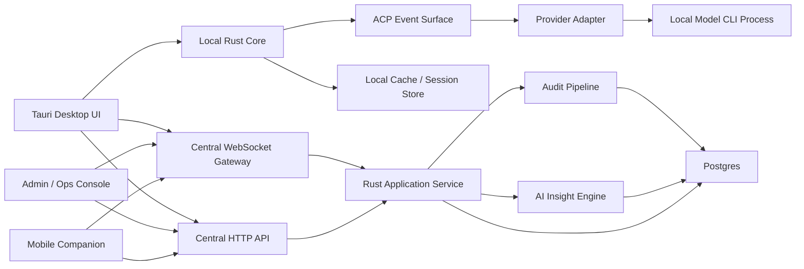
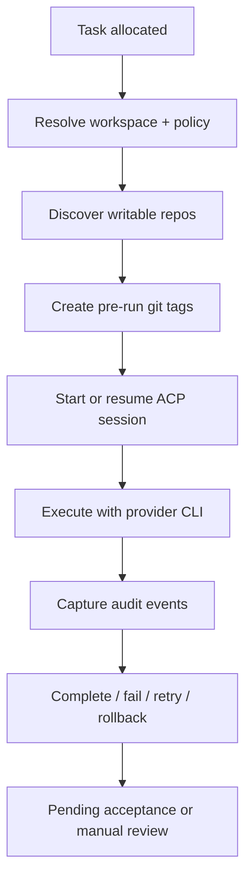

# System Architecture

## 1. Architecture Summary

The system is a hybrid local-execution and central-coordination platform.

- the desktop app runs locally on each user's machine
- each local Agent maps to a provider-backed local model CLI process
- the UI consumes a normalized ACP-like Agent event surface
- provider-native runtime protocols may be used below the adapter boundary when they offer richer long-session control
- the central service manages projects, tasks, permissions, queue ordering, audit ingestion, and synchronization

Initial provider:

- Codex CLI is the first provider implementation

Future providers:

- Claude CLI
- Kimi CLI
- MiniMax CLI
- other local or proxied CLIs

## 2. Topology

## 3. Major Components

### 3.1 Desktop Shell

Recommended stack:

- `Tauri 2`
- Rust for desktop-side orchestration
- React + TypeScript for UI rendering

Companion surface:

- mobile app should be treated as a separate client surface, not a scaled-down desktop layout

Responsibilities:

- application shell
- left/right split layout
- native menus
- OS integration
- local process management
- local settings and auto-start behavior

### 3.2 Local Rust Core

Responsibilities:

- manage provider child processes
- maintain ACP sessions
- bind tasks to sessions
- enforce local workspace policy
- create pre-run git tags
- capture audit events and forward them to server
- cache local session metadata for resume/recovery

Submodules:

- `agent_manager`
- `task_executor`
- `provider_registry`
- `workspace_guard`
- `git_safety`
- `audit_forwarder`
- `session_store`
- `websocket_client`

### 3.3 ACP-Like Event Surface

Responsibilities:

- expose one uniform event contract to the UI
- keep the Agent workspace stable even when providers differ
- normalize provider-specific capabilities into ACP-shaped events where possible

Important rule:

- this is a normalized product surface, not a requirement that every provider must speak external standard ACP directly
- Codex v0.02 should use `codex app-server` under the adapter layer and map it into this surface

### 3.4 Provider Adapter Layer

Responsibilities:

- launch provider processes
- translate runtime requests into provider-native requests
- normalize provider-native events back into the ACP event surface
- classify provider actions for audit and dangerous-action reporting

Provider modes:

- `native_acp`
- `adapted`
- `text_only`

Design principle:

- the UI is an ACP event renderer, not just a chat box
- the adapter may use native runtime protocols internally as long as it emits normalized Spotlight runtime events upward

### 3.5 Central Sync Service

Recommended stack:

- Rust
- Axum
- Postgres
- WebSocket

Responsibilities:

- project membership and visibility
- task creation and queue ordering
- approval and acceptance records
- Agent presence and auto mode status
- public queue and assigned queue dispatch decisions
- audit log ingestion and dangerous action visualization
- rollback history
- mobile-friendly summary APIs and push-notification triggers
- admin console APIs for project config, role grants, monitoring, billing, and platform operations
- AI insight orchestration, prompt shaping, caching, and forecast generation

## 4. Execution Model

### 4.1 Local Agent Execution

Each Agent:

- runs on a user's local machine
- owns independent sessions
- can auto-pull work
- executes task logic locally using its configured provider

Session isolation:

- multiple Agents in one project are independent
- context is not automatically shared between Agents
- session history is linked through task runs, not through shared memory

### 4.2 Event-Driven Auto Execution

The system is event-driven but still queue-safe.

Flow:

1. server emits a WebSocket event indicating eligible queued work exists
2. desktop core wakes eligible Agents
3. Agent calls `pull-next`
4. server atomically allocates the oldest eligible task
5. local executor performs preflight and starts the task run

Why this model:

- avoids wasteful polling
- still prevents race conditions by keeping claim logic server-side and atomic

## 5. Task Execution Pipeline

## 6. Multi-Workspace Behavior

Project model:

- one project can have many workspace roots
- a task run chooses one primary workspace
- additional project workspaces may be attached

Execution policy:

- project workspaces may be writable
- external directories are read-only
- temp directories are writable

## 7. Dangerous Action Handling

The recommended interception strategy is:

- ACP action classification as the primary control point
- command/process metadata as a secondary signal

Reasoning:

- ACP action streams are closer to user intent and easier to normalize across platforms
- commands alone are too noisy and OS-specific

Implementation approach:

- classify actions like `delete_file`, `overwrite_file`, `rewrite_git_history`, `execute_script`
- persist structured dangerous action events
- attach raw command or tool metadata as supplemental detail

## 8. Git Safety Layer

Before a task run enters execution:

- detect writable repositories under active project workspaces
- create a standardized pre-run tag in each repository
- record repository cleanliness, branch, HEAD, and tag result

Recommended tag pattern:

- `task/<task_id>/pre-run/<YYYYMMDDTHHMMSSZ>`

## 9. Presence and Coordination

The central service tracks:

- Agent online status
- Agent auto mode on/off
- last heartbeat
- session count
- current task
- current project

This enables:

- reassignment if an assigned Agent stays offline
- visibility into which Agents can take work
- operations dashboards
- mobile task-list and Agent-status monitoring

## 10. Deployment Shape

### 10.1 Desktop

- distributed to end users as a Tauri application
- includes Rust core and front-end bundle
- depends on at least one supported local provider installation

### 10.1.1 Mobile Companion

- mobile app is a companion client for visibility and lightweight control
- primary mobile use cases are task browsing, Agent run status, alerts, approval, and interruption
- mobile app should not try to replicate the full desktop ACP workspace in MVP

### 10.2 Server

- single Rust service for MVP is sufficient
- Postgres required
- WebSocket gateway can be embedded in the same service

### 10.3 Future Split

Possible future service decomposition:

- identity and authorization
- queue orchestration
- audit pipeline
- notification gateway

Not required for MVP.
