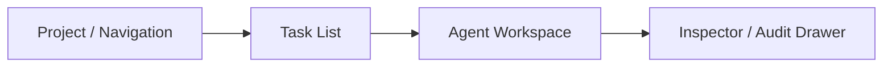

# UI Information Architecture

## 1. Design Goal

The desktop UI should feel like a code-first operational workspace:

- focused
- dense but readable
- keyboard-friendly
- streaming-first
- optimized for long-running Agent collaboration

Zed is the visual reference, but the product remains task-centric and coordination-centric rather than editor-centric.

## 2. Primary Layout

Recommended desktop layout:

- left sidebar for project switcher and project metadata
- left-main pane for the task queue
- right-main pane for Agent workspace
- optional bottom or right drawer for audit, dangerous actions, and task details

## 3. Main Screens

### 3.1 Project Home

Contains:

- current project identity
- visible workspaces
- Agent presence summary
- queue summary
- pending approvals
- pending acceptance count
- dangerous action alerts

### 3.2 Task Queue View

Each row should show:

- title
- status
- assignment mode
- requested/active Agent
- creator
- approver state
- acceptance owner
- retry count
- updated time

Primary actions:

- add
- claim
- request approval
- approve
- assign/reassign
- open in Agent
- stop
- rollback

Suggested queue tabs:

- `Open`
- `Approval`
- `Running`
- `Acceptance`
- `Manual Review`
- `Done`

### 3.3 Agent Workspace

Main sections:

- session tabs
- conversation timeline
- composer/input
- run status header
- workspace breadcrumbs
- tool/action event stream

Task-bound header should show:

- task title
- current state
- current run number
- current attempt number
- Agent name
- auto mode badge
- primary workspace

### 3.4 Audit and Risk Drawer

This panel should surface:

- dangerous actions
- git tags created for current run
- rollback history
- approval records
- acceptance records
- retries

## 4. Key Interaction Flows

### 4.1 Add Task

1. user clicks `Add Task`
2. modal or inline panel opens
3. user enters free-form requirement text
4. user optionally selects workspace, assigned Agent, approval requirement, acceptance owner
5. task is created in queue

### 4.2 Claim Task

1. user selects a task
2. user clicks `Claim`
3. user chooses a local Agent if multiple are available
4. task becomes `claimed`
5. right-side Agent workspace opens with task prompt prepared

### 4.3 Approval Flow

1. user clicks `Request Approval`
2. task moves to `approval_requested`
3. authorized user sees task in approval queue
4. approver clicks `Approve`
5. task moves to `approved`
6. Agent may start execution

### 4.4 Auto Mode Flow

1. Agent auto mode is enabled
2. server emits `task.available`
3. local Agent wakes and calls `pull-next`
4. task becomes `auto_claimed`
5. preflight, tagging, and execution start automatically

### 4.5 Acceptance Flow

1. Agent completes run
2. task moves to `pending_acceptance`
3. acceptor reviews timeline, diffs, logs, and artifacts
4. acceptor chooses `Accept` or `Reject`
5. reject returns task to `open`

### 4.6 Rollback Flow

1. user stops a running or failed task
2. user clicks `Rollback`
3. UI shows candidate repositories and pre-run tags
4. rollback begins
5. audit drawer shows rollback event and result

## 5. Agent UI Behavior

The Agent pane should render ACP events as first-class UI blocks.

Recommended timeline item types:

- user message
- Agent message
- tool invocation
- command started
- command output
- file write summary
- dangerous action highlight
- status transition
- approval prompt
- error

Recommended session actions:

- new session
- resume session
- reopen session
- interrupt
- bind current task
- detach task view

## 6. Visual Hierarchy

Recommended emphasis:

- task state color is subtle, not loud
- dangerous actions use strong contrast
- current running task remains pinned at top of Agent pane
- acceptance and manual-review items are visibly distinct from normal open tasks

## 7. Desktop Navigation Model

Top-level navigation:

- Projects
- Queue
- Agents
- Risk & Audit
- Settings

Project-local navigation:

- Overview
- Tasks
- Agents
- Acceptance
- Audit

## 8. Empty and Failure States

Must support:

- no visible projects
- no tasks in queue
- no local Agents configured
- Codex CLI unavailable
- ACP session disconnected
- server offline but local session still running

Recommended recovery affordances:

- reconnect
- reopen local session
- continue offline view
- retry sync

## 9. Mobile and Small-Screen Constraints

Desktop is primary, but the layout should degrade reasonably.

Minimum requirements:

- collapsible left queue pane
- full-screen Agent pane option
- drawer-based audit panel

## 10. Accessibility

Minimum accessibility requirements:

- full keyboard navigation
- visible focus states
- color is never the only status signal
- timeline items must be screen-reader distinguishable
